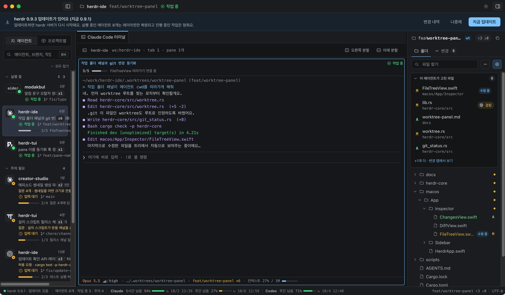
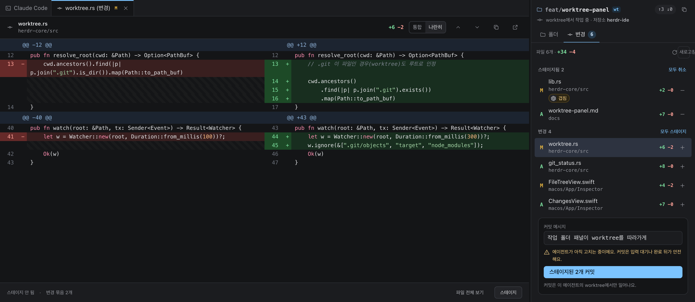

# AgentDeck

[한국어](#한국어) · [English](#english)



---

## 한국어

AgentDeck은 [Herdr](https://herdr.dev)에서 돌고 있는 코딩 에이전트를 한 창에서 보는 macOS 앱입니다.
에이전트를 고르면 그 에이전트의 터미널, 작업 폴더, 바뀐 파일을 나란히 보여 줍니다.

### 무엇을 할 수 있나요

- **답을 기다리는 에이전트 찾기** — 프로젝트 탭과 왼쪽 목록에 입력 대기·실패·안 본 완료 수가 붙습니다. 목록의 각 줄에는 에이전트 로고, 작업 제목, 상태, 브랜치, 바뀐 파일 수가 보입니다. ⌘K로 에이전트·브랜치·작업을 찾습니다.
- **에이전트 터미널에서 바로 작업** — 가운데 터미널에서 에이전트에 입력하고 질문·승인에 답합니다. pane을 최대 6개까지 나누고, pane 아래에 모델·추론 강도·브랜치·컨텍스트 사용률이 보입니다.
- **에이전트가 고치는 파일 따라가기** — 오른쪽 패널이 에이전트가 고친 파일을 모으고, 지금 고치는 파일에 "수정 중"을 붙입니다. 다른 에이전트가 다른 브랜치에서 같은 파일을 고치면 "겹침"으로 알려 줍니다.
- **변경 확인하고 커밋하기** — 통합·나란히 diff로 보고, 파일마다 스테이지해서 그 에이전트의 worktree에 커밋합니다.
- **사용량** — 상태 막대에 계정의 남은 사용량(5시간·주간)과 초기화 시각이 보입니다.
- **알림** — 켜 두면 질문·승인 대기, 작업 완료, 컨텍스트·사용량 기준 초과를 알림센터 배너로 알려 줍니다. 배너를 누르면 그 pane으로 갑니다.
- **Herdr 설치·업데이트** — herdr가 없으면 첫 실행 때 내려받아 SHA-256을 확인하고 설치합니다. 새 버전이 나오면 창 위 배너로 알려 줍니다.



화면은 [디자인 프로토타입](https://chonamdoo.github.io/AgentDeck/)에서 캡처했습니다. 실제 앱과 세부 모양은 다를 수 있습니다.

### 설치

Homebrew:

```sh
brew install --cask chonamdoo/tap/agentdeck
```

DMG로 설치한 AgentDeck이 이미 `응용 프로그램` 폴더에 있으면 AgentDeck을 종료하고 한 번만 `--force`를 붙입니다. 그다음부터는 Homebrew가 관리합니다.

직접 받으려면:

1. [Releases](../../releases)에서 `AgentDeck-<버전>-apple-silicon.dmg`를 받습니다.
2. DMG를 열고 `AgentDeck`을 `응용 프로그램` 폴더로 끌어다 놓습니다.
3. Developer ID로 서명하고 Apple 공증을 받은 앱이라 바로 열립니다.

받은 DMG는 `shasum -a 256 AgentDeck-<버전>-apple-silicon.dmg` 결과를 릴리스 노트의 SHA-256과 비교해 확인할 수 있습니다.

### 필요한 것

- Apple Silicon Mac(M1 이상), macOS 14(Sonoma) 이상. Intel Mac은 지원하지 않습니다.
- `herdr` CLI. `brew install herdr`로 설치하거나 AgentDeck 첫 실행 때 설치합니다. AgentDeck은 `~/.local/bin`, `/opt/homebrew/bin`, `/usr/local/bin`, `PATH`에서 찾습니다. Herdr는 DMG에 들어 있지 않습니다.

### 업데이트

Homebrew로 설치했다면:

```sh
brew upgrade --cask agentdeck
```

DMG로 설치했다면 새 DMG를 받아 `응용 프로그램` 폴더의 AgentDeck을 바꿉니다.

### Pre-release

지금 릴리스는 pre-release입니다. 실제 에이전트 pane에서의 15분 한글 IME 사용과 Terminal.app + Herdr 대비 메모리 비교를 마치면 정식 릴리스를 냅니다.

### 라이선스

[Apache-2.0](LICENSE). 개인·기업 모두 무료입니다. 함께 들어 있는 오픈 소스는 [THIRD_PARTY_NOTICES](THIRD_PARTY_NOTICES)에 있습니다. 두 파일은 DMG 안에도 들어 있습니다. Herdr는 따로 배포·라이선스됩니다.

이 저장소에는 릴리스 DMG와 소개만 있습니다. 소스는 별도 저장소에 있습니다.

---

## English

AgentDeck is a macOS app for watching the coding agents running in [Herdr](https://herdr.dev) from one window.
Pick an agent and see its terminal, its working folder and the files it changed side by side.

### What it does

- **Find the agents waiting on you** — project tabs and the sidebar count agents waiting for input, failed, or done but not yet seen. Each row shows the agent's logo, task title, state, branch and number of changed files. ⌘K searches agents, branches and tasks.
- **Work in the agent's terminal** — type to the agent and answer its questions and approvals in the center terminal. Split up to six panes; each pane shows model, reasoning effort, branch and context usage underneath.
- **Follow the files an agent edits** — the right panel collects the files the agent changed and marks the one it is editing now. When another agent edits the same file on another branch, it is marked as overlapping.
- **Review and commit** — read changes as unified or side-by-side diffs, stage file by file, and commit to that agent's worktree.
- **Usage** — the status bar shows each account's remaining usage (5-hour and weekly) and when it resets.
- **Notifications** — when turned on, Notification Center banners tell you when an agent waits for an answer or approval, finishes, or crosses a context or usage threshold. Click a banner to jump to its pane.
- **Herdr install and updates** — without herdr, the first launch downloads it, checks its SHA-256 and installs it. New versions show up as a banner at the top of the window.

Screenshots come from the [design prototype](https://chonamdoo.github.io/AgentDeck/); the app may differ in detail.

### Install

Homebrew:

```sh
brew install --cask chonamdoo/tap/agentdeck
```

If a DMG install already sits in `Applications`, quit AgentDeck and add `--force` once; Homebrew manages it from then on.

Or by hand:

1. Download `AgentDeck-<version>-apple-silicon.dmg` from [Releases](../../releases).
2. Open the DMG and drag `AgentDeck` into `Applications`.
3. The app is Developer ID signed and notarized by Apple, so it opens without warnings.

To verify the download, compare `shasum -a 256 AgentDeck-<version>-apple-silicon.dmg` with the SHA-256 in the release notes.

### Requirements

- Apple Silicon Mac (M1 or later) on macOS 14 (Sonoma) or later. Intel Macs are not supported.
- The `herdr` CLI: `brew install herdr`, or install it from AgentDeck on first launch. AgentDeck looks in `~/.local/bin`, `/opt/homebrew/bin`, `/usr/local/bin`, then `PATH`. Herdr is not bundled in the DMG.

### Updates

With Homebrew:

```sh
brew upgrade --cask agentdeck
```

With a DMG install, download the new DMG and replace AgentDeck in `Applications`.

### Pre-release

Current releases are pre-releases. A final release follows a 15-minute Korean IME session in real agent panes and a memory comparison against Terminal.app + Herdr.

### License

[Apache-2.0](LICENSE), free for personal and commercial use. Bundled open source is listed in [THIRD_PARTY_NOTICES](THIRD_PARTY_NOTICES); both files are also inside the DMG. Herdr is distributed and licensed separately.

This repository holds only the release DMGs and this introduction; the source lives in a separate repository.
